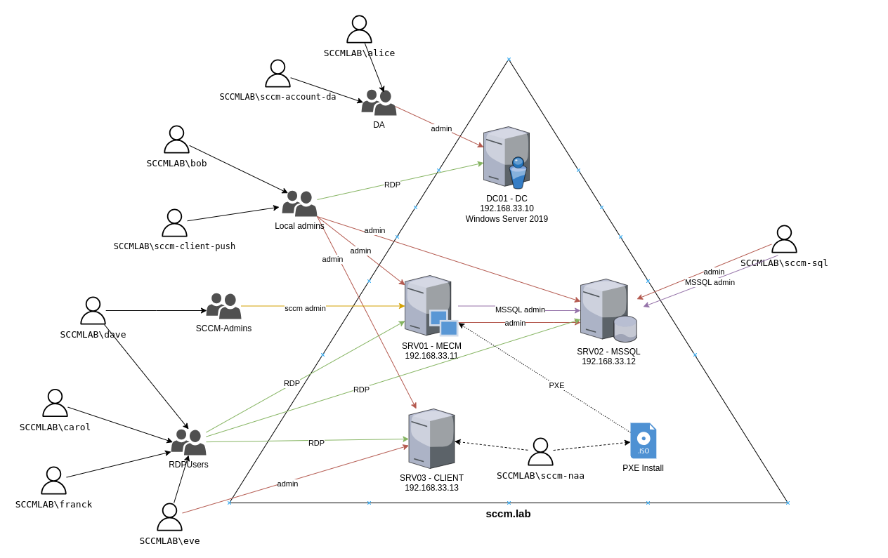

# SCCM lab

!!! success "Thanks!"
    Thanks a lot to my colleague Issam (@KenjiEndo15), who start the project and provide me a lot of ansible roles to start from !



## Servers
4 virtual machines with Windows Server 2019

- **DC** :  Domain Controler 
- **MECM** : mecm primary site serer
- **MSSQL** : mecm sql server
- **CLIENT** : mecm client computer

All vms got defender activated

## Prerequisites
- The prerequisites for the lab are the same as GOAD lab (virtualbox/vmware, python, ansible,...)
- The lab take 16GB for the vagrant image + 100GB for the 4 vms
- The installation take environ 2,5 hours (with fiber connection)
- The lab download multiple files during the install (windows iso, mecm installation package, mssql installation package, ...), be sure to have a good internet connection.

## Writeup

- A writeup on SCCM exploitation is available here : [https://mayfly277.github.io/categories/sccm/](https://mayfly277.github.io/categories/sccm/)

## proxmox installation
- In order to use the proxmox provider follow this :

1) create a template with the windows_server2019_proxmox_cloudinit_uptodate.pkvars.hcl packer file (guide here: https://mayfly277.github.io/posts/GOAD-on-proxmox-part2-packer/) (note the id after the creation)

2) create the variable file (ad/SCCM/providers/proxmox/terraform/variables.tf) by coping the template (ad/SCCM/providers/proxmox/terraform/variables.tf.template) and change the value according to your proxmox environnement

3) on the provisioning computer :
```bash
./goad.sh -t check -l SCCM -p proxmox -m local
./goad.sh -t install -l SCCM -p proxmox -m local
```

4) if something goes wrong (restart of the vms during install, etc...), you can rerun only ansible with -a
```bash
./goad.sh -t install -l SCCM -p proxmox -m local -a
```