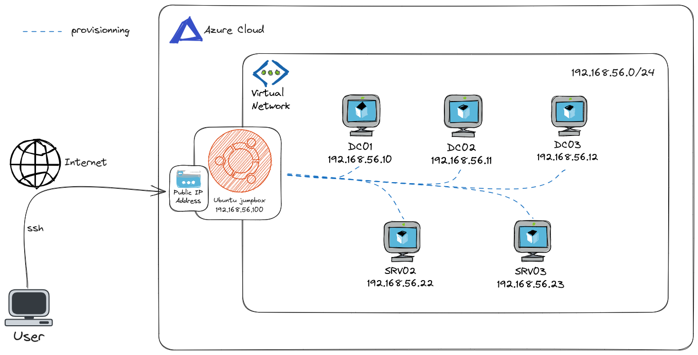

# :material-microsoft-azure: Azure

!!! success "Thanks!"
    Thx to Julien Arault for the initial work on the azure provider


<div align="center">
  
  
  
</div>



!!! Warning
    LLMNR, NBTNS and other poisoning network attacks will not work in azure environment.
    Only network coerce attacks will work.

## Prerequisites

- [Terraform](https://www.terraform.io/downloads.html)
- [Azure CLI](https://docs.microsoft.com/en-us/cli/azure/install-azure-cli?view=azure-cli-latest)

## Azure configuration

You need to login to Azure with the CLI.

```bash
az login
```

## Goad configuration

- The goad configuration file as some options for azure:

```
# ~/.goad/goad.ini
...
[azure]
az_location = westeurope
```

- If you want to use a different location you can modify it.


## Installation

```bash
# check prerequisites
./goad.sh -t check -l GOAD -p azure
# Install
./goad.sh -t install -l GOAD -p azure
```

or from the interactive console :

```bash
GOAD/azure/remote/192.168.56.X > install
```

## start/stop/status

- You can see the status of the lab with the command `status`
- You can also start and stop the lab with the command `start` and `stop`

!!! info
    The command `stop` use deallocate, it take a long time to run but it is not only stopping the vms, it will deallocate them. By doing that, you will stop paying from them (but you still paying storage) and can save some money.

## VMs sku

- The vm used for goad are defined in the lab terraform file : `ad/<lab>/providers/azure/windows.tf`
- This file is containing information about each vm in use

```
"dc01" = {
  name               = "dc01"
  publisher          = "MicrosoftWindowsServer"
  offer              = "WindowsServer"
  windows_sku        = "2019-Datacenter"
  windows_version    = "17763.4377.230505"
  private_ip_address = "{{ip_range}}.10"
  password           = "8dCT-DJjgScp"
  size               = "Standard_B2s"
}
```

## How it works ?

- On the installation goad script will create a folder into `goad/workspaces/<instance_folder>`
- This folder will contain the terraform scripts and some of the ansible inventories
- Goad will create the cloud infrastructure with terraform.
- The lab is created (not provisioned yet) and a "jumpbox" vm is also created
- Next the needed sources will be pushed to the jumpbox using `ssh` and `rsync`
- The jumpbox ssh_key is stored on `goad/workspaces/<instance_folder>/ssh_keys`
- The jumpbox is prepared to run ansible
- The provisioning is launch with ssh remotely on the jumpbox

## Install step by step

```bash
GOAD/azure/remote/192.168.56.X > create_empty # create empty instance
GOAD/azure/remote/192.168.56.X > load <instance_id>
GOAD/azure/remote/192.168.56.X (<instance_id>) > provide # play terraform
GOAD/azure/remote/192.168.56.X (<instance_id>) > sync_source_jumpbox # sync jumpbox source
GOAD/azure/remote/192.168.56.X (<instance_id>) > prepare_jumpbox # install dependencies on jumpbox
GOAD/azure/remote/192.168.56.X (<instance_id>) > provision_lab # run ansible
```

## Tips

- To connect to the jumpbox VM you can use `ssh_jumpbox` in the goad interactive console
- To setup a socks proxy you can use `ssh_jumpbox_proxy <proxy_port>` in the goad interactive console

- If the command `destroy` or `delete` fails, you can delete the resource group using the CLI
```bash
az group delete --name GOAD
```